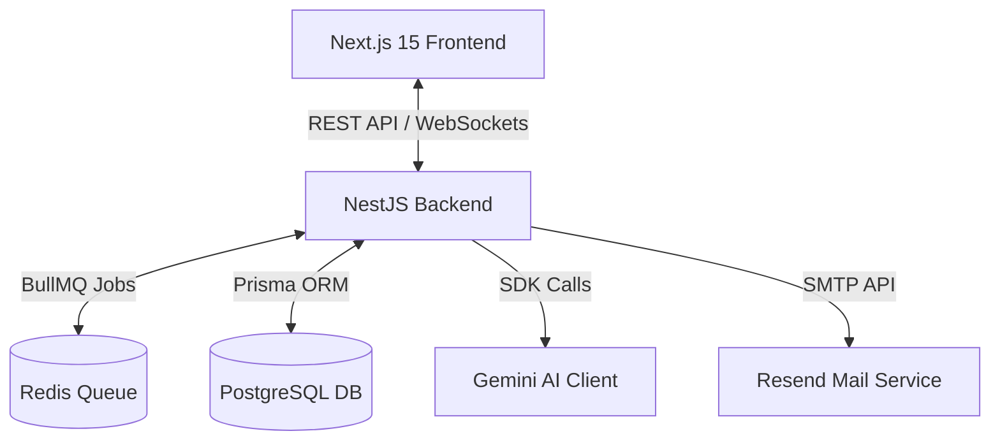

# EassyNest — Rent & Flatmate Finder

EassyNest is a modern, AI-powered property listing and flatmate discovery platform designed to solve the age-old problem of roommate matching. Rather than focusing solely on listing characteristics, EassyNest emphasizes lifestyle, location, and budget alignment to ensure seamless co-living.

---

## 📸 Screenshots Showcase
*Below are placeholder sections for screenshots of the key flows. You can drag and drop your screenshots here.*

### 1. Landing Page & Hero Section

*The first point of contact featuring interactive search pathways for rooms and flatmates.*

### 2. Search & Filter Interface (Map & List Split View)

*The property discovery view utilizing Leaflet Maps side-by-side with sorted cards and compatibility scores.*

### 3. Tenant Seeker Profile Creator

*Detailed profile builder where tenants enter budget ranges, preferred locations, move-in dates, and lifestyle tags.*

### 4. Compatibility Score Detail (AI Explanation Popover)

*A visual ring displaying compatibility score percentage with an inline popover explaining the LLM's assessment.*

### 5. Real-Time Chat Room

*The secure in-app messaging terminal enabled once an owner accepts a tenant's interest request.*

### 6. Admin Control Center

*Platform-wide activity stream tracking active users, listings, interest conversions, and user moderation.*

---

## 🎯 Project Objective & Scope

### Objective
Renting a room involves more than just price; it requires finding someone whose expectations on location, budget, and lifestyle align. EassyNest implements an AI compatibility engine that scores, explains, and ranks listings, enables real-time messaging after matched interest, and notifies stakeholders when optimal compatibility is found.

### Scope of Work
- **Role-Based Authentication:** Distinct registration and dashboards for **Tenants** (Seekers), **Owners** (Listers), and **Admins** (Moderators).
- **Core Listings & Seeker Profiles:** Owners manage detailed properties (rent, location, furnishing, room type, photos). Tenants manage profile matching fields (budget range, preferred city, move-in date, sleep schedules, smoker status, pet friendly preferences).
- **AI Match & Rank:** List views are sorted dynamically by AI Compatibility Scores.
- **Interest Requests:** Tenants request connections; Owners can Accept or Decline.
- **WebSocket Messaging:** Accepted interests auto-provision encrypted-like chat rooms with real-time delivery and message histories.
- **Automated Email & Push Notifications:** Key connection milestones trigger instant notifications (e.g. emails on high compatibility matches).

---

## 🏗️ Technical Architecture & Directory Structure



### Key Folders
- `/backend`: NestJS source code.
  - `src/auth`: JWT strategies, guards, roles management.
  - `src/properties`: Property listings CRUD, status toggling, public searches.
  - `src/seekers`: Seeker profile configuration, preferred locations.
  - `src/scores`: AI & rule-based scoring module, BullMQ workers.
  - `src/interests`: Expressing interest, accept/decline workflows.
  - `src/chat`: WebSockets gateways, messaging controllers.
  - `src/notifications`: In-app event logs, transactional mail queues.
- `/frontend`: Next.js 15 App Router source code.
  - `src/app`: Page routes (`/properties`, `/flatmates`, `/chat`, `/dashboard`).
  - `src/components`: Global elements (`navbar`, `listing-card`, `map-view`).
  - `src/components/ui`: Custom UI library (`button`, `badge`, `input`, `avatar`, `compatibility-badge`, `empty-state`).
  - `src/lib`: Network state managers (`api`, `auth-context`, `socket`).

---

## 📊 Database Model & Schema Overview

EassyNest structures data models to support polymorphic targeting. Scores and Interest records link to either a `Property` or another `SeekerProfile` depending on context.

```prisma
// Main entities within Prisma schema (schema.prisma)

model User {
  id            String          @id @default(cuid())
  email         String          @unique
  passwordHash  String
  name          String
  role          Role            // TENANT, OWNER, ADMIN
  isActive      Boolean         @default(true)
  properties    Property[]
  seekerProfile SeekerProfile?
  sentInterests Interest[]      @relation("InterestFrom")
}

model Property {
  id               String            @id @default(cuid())
  ownerId          String
  owner            User              @relation(fields: [ownerId], references: [id])
  title            String
  city             String
  rent             Int
  availableFrom    DateTime
  roomType         RoomType          // SINGLE_ROOM, SHARED_ROOM, ONE_BHK, etc.
  furnishing       FurnishingStatus  // FURNISHED, SEMI_FURNISHED, UNFURNISHED
  status           ListingStatus     @default(ACTIVE) // Hides from search if FILLED
}

model SeekerProfile {
  id            String        @id @default(cuid())
  userId        String        @unique
  user          User          @relation(fields: [userId], references: [id])
  type          SeekerType    // ROOM_SEEKER, FLATMATE_SEEKER, BOTH
  preferredCity String
  budgetMin     Int
  budgetMax     Int
  moveInDate    DateTime
}

model CompatibilityScore {
  id                    String        @id @default(cuid())
  seekerProfileId       String
  targetType            TargetType    // PROPERTY, SEEKER_PROFILE
  targetPropertyId      String?
  targetSeekerProfileId String?
  score                 Int           // 0 to 100
  explanation           String
  source                ScoreSource   // LLM, RULE_BASED
}
```

---

## 🤖 AI Compatibility Scoring Engine (LLM Details)

### 1. Prompt Specifications
The system utilizes a structured system instructions format passed directly to **Gemini 2.5 Flash** models to compute matches.

#### System Instruction
```text
You are a compatibility scoring engine for a rental platform. Score strictly
based on budget fit and location match. Respond with JSON only, no markdown,
no prose outside the JSON object.
```

#### User Prompt Template
```text
Room listing:
- City: {property.city}
- Rent: ₹{property.rent}/month
- Room type: {property.roomType}
- Furnishing: {property.furnishing}
- Available from: {property.availableFrom}

Tenant profile:
- Preferred city: {seeker.preferredCity}
- Budget: ₹{seeker.budgetMin} - ₹{seeker.budgetMax}/month
- Move-in date: {seeker.moveInDate}

Compute a compatibility score from 0 to 100 based on budget and location
match. Return JSON: { "score": number, "explanation": string }
```

### 2. Example I/O
#### JSON Input Data
```json
{
  "property": {
    "city": "Pune",
    "rent": 14000,
    "roomType": "SINGLE_ROOM",
    "furnishing": "SEMI_FURNISHED",
    "availableFrom": "2026-08-01"
  },
  "seeker": {
    "preferredCity": "Pune",
    "budgetMin": 10000,
    "budgetMax": 15000,
    "moveInDate": "2026-08-05"
  }
}
```
#### JSON Output Payload
```json
{
  "score": 88,
  "explanation": "Rent falls within budget with some margin, same city, and move-in dates are 4 days apart — a strong match."
}
```

### 3. Rule-Based Fallback Scoring Logic
If the Gemini API encounters rate limits, timeouts, or quota blocks, EassyNest immediately invokes a local, deterministic rule-based generator:
```javascript
// Rule-based algorithm implementation
let locationScore = (seeker.preferredCity.toLowerCase() === property.city.toLowerCase()) ? 60 : 20;

// Calculate percentage of budget range overlap
let budgetOverlap = calculateOverlap(seeker.budgetMin, seeker.budgetMax, property.rent);
let budgetScore = 40 * budgetOverlap;

// Date proximity penalty (max 10 points penalty if > 30 days difference)
let dateDiffDays = Math.abs(seeker.moveInDate - property.availableFrom) / (1000 * 60 * 60 * 24);
let datePenalty = dateDiffDays > 30 ? 10 : Math.min(10, dateDiffDays * 0.33);

let finalScore = Math.max(0, Math.min(100, Math.round(locationScore + budgetScore - datePenalty)));
let explanation = "Score computed using budget and location match (AI scoring temporarily unavailable).";
```

---

## ✉️ Transactional Email & Messaging Gateway

### Email Notification Rules
1. **High Match Interest:** When a Tenant expresses interest in a listing with a compatibility score **>= 80**, an email notification is automatically dispatched to the Owner alerting them of a high-value candidate.
2. **Interest Decision:** When an Owner accepts or declines an interest request, an automated email goes out to the Tenant summarizing the decision.
3. **Queue Resilience:** Email sending is executed via asynchronous Redis workers (BullMQ). If Resend or the SMTP provider fails, the task is retried automatically rather than failing the client request.

### Real-Time Chat Security Gates
- Chat channels are created **only** when an Interest moves to `ACCEPTED`.
- A NestJS WebSocket Gateway manages persistent socket connections via **Socket.IO**.
- Gateways perform validation check gates at the connection phase:
  ```typescript
  // Gate check before joining a chat room
  const user = await this.jwtService.verifyAsync(token);
  const isParticipant = await this.prisma.interest.findFirst({
    where: {
      id: interestId,
      status: 'ACCEPTED',
      OR: [
        { fromUserId: user.id },
        { targetProperty: { ownerId: user.id } },
        { targetSeekerProfile: { userId: user.id } }
      ]
    }
  });
  if (!isParticipant) throw new WsException('Unauthorized chat participant');
  ```

---

## 📐 System Design Write-Up

### 1. Compatibility Scoring Design
EassyNest processes compatibility scoring dynamically and registers it inside the database to eliminate continuous scoring bottlenecks. A single `CompatibilityScore` model stores scores between a seeker profile and a target entity. This target is polymorphic (a `Property` for room searches or another `SeekerProfile` for flatmate searches). 

Scores are computed once upon the first user interaction (typically when a tenant views a property details card or clicks express interest). Once calculated, they are indexed and stored. This allows the property browsing pages to sort listings by compatibility ranking on the fly using standard database sorting, avoiding expensive compute loops during active user searches. Invalidation events are configured via DB listeners: if an owner edits their room's rent price or a tenant shifts their search budget, the existing score record is deleted, prompting a re-calculation on the next page view.

### 2. LLM Integration & Fallback
The LLM scoring mechanism is designed to operate asynchronously. When a profile-listing matching request is made, EassyNest creates a job within a Redis-backed queue managed by BullMQ. The system communicates with the Gemini API inside background worker threads, freeing the core API thread from blocking wait states.

Each AI-scoring operation has a strict timeout of 8 seconds. If the API fails to respond or triggers rate limits, the BullMQ job executes a secondary retry sequence. If both execution runs fail, the system falls back to a deterministic, local rule-based matching engine. The local scorer evaluates budget boundary overlaps and location matches to approximate a score on the same 0-100 index. It stores the result marked as `source: RULE_BASED`. This ensures ranking features stay operational and prevent front-end interface disruptions if the third-party AI service goes down.

### 3. Chat Implementation
Real-time messaging is restricted to validated connections. Chat rooms cannot be created manually; they are instantiated automatically once an owner accepts an interest request sent by a tenant.

The real-time layer is implemented using a NestJS WebSocket Gateway backed by Socket.IO. Upon connecting, clients register with the gateway using JWT tokens. When a user joins a chat room, the backend checks database records to confirm the user corresponds to either the tenant who requested matching or the listing's owner. If authorized, the socket joins a room keyed by the interest ID. Messages are persisted to PostgreSQL before broadcast, ensuring that users have access to historical message records even if they refresh their browser or experience connection breaks.

### 4. Notification Flow
The notification system is divided into push-based transactional emails and stateful in-app notification alerts. The generation of email notifications occurs through asynchronous job queues to ensure quick API responses for user interactions.

When a tenant submits interest on a listing scoring **80 or higher**, the backend triggers a high-match event. The worker dispatches an email to the property owner containing compatibility metrics. Similarly, when the owner accepts or declines, the system sends an email to the tenant detailing the response. Simultaneously, in-app notifications are stored directly in the database. These alerts are broadcasted to active sessions via WebSocket connections, updating notification badges dynamically.

---

## 🚀 Setup & Execution
For complete, step-by-step guidance on running EassyNest locally, setting up database migrations, and configuring API keys, please consult the separate **[Setup Guide (SETUP.md)](SETUP.md)**.
