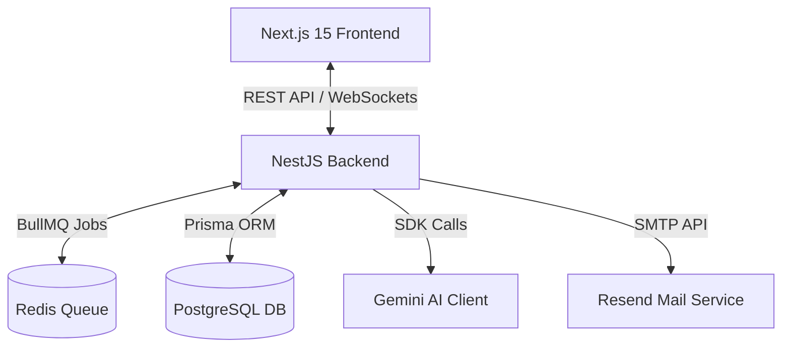
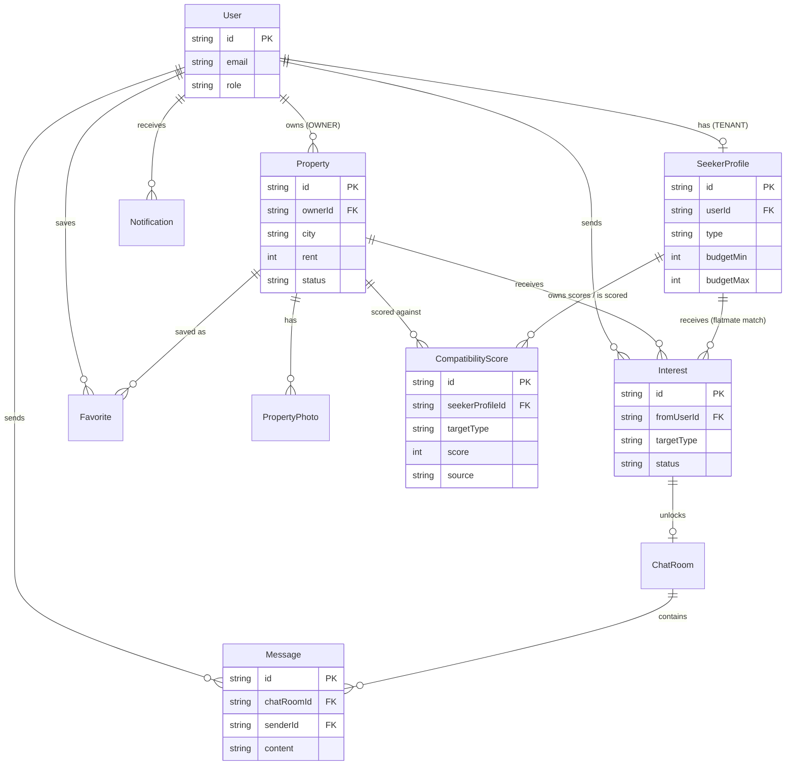

# 🏠 EassyNest — AI-Powered Rent & Flatmate Finder

<p align="center">

<a href="https://eassy-nest.vercel.app/" target="_blank">
  
</a>

<a href="https://github.com/YOUR_USERNAME/YOUR_REPO">
  
</a>

</p>

##  Quick Links

-  **Live Demo:** https://eassy-nest.vercel.app/ 

EassyNest is a modern, AI-powered property listing and flatmate discovery platform designed to solve the age-old problem of roommate matching. Rather than focusing solely on listing characteristics, EassyNest emphasizes lifestyle, location, and budget alignment to ensure seamless co-living.

---

## 📸 Screenshots Showcase
*Below are placeholder sections for screenshots of the key flows. You can drag and drop your screenshots here.*

### 1. Landing Page & Hero Section

*The first point of contact featuring interactive search pathways for rooms and flatmates.*

### 2. Search & Filter Interface (Map & List Split View)

*The property discovery view utilizing Leaflet Maps side-by-side with sorted cards and compatibility scores.*

### 3. Tenant Seeker Profile Creator

*Detailed profile builder where tenants enter budget ranges, preferred locations, move-in dates, and lifestyle tags.*

### 4. Compatibility Score Detail (AI Explanation Popover)

*A visual ring displaying compatibility score percentage with an inline popover explaining the LLM's assessment.*

### 5. Real-Time Chat Room

*The secure in-app messaging terminal enabled once an owner accepts a tenant's interest request.*

### 6. Admin Control Center

*Platform-wide activity stream tracking active users, listings, interest conversions, and user moderation.*

---

## 🎯 Project Objective & Scope

### Objective
Renting a room involves more than just price; it requires finding someone whose expectations on location, budget, and lifestyle align. EassyNest implements an AI compatibility engine that scores, explains, and ranks listings, enables real-time messaging after matched interest, and notifies stakeholders when optimal compatibility is found.

### Scope of Work
- **Role-Based Authentication:** Distinct registration and dashboards for **Tenants** (Seekers), **Owners** (Listers), and **Admins** (Moderators).
- **Core Listings & Seeker Profiles:** Owners manage detailed properties (rent, location, furnishing, room type, photos). Tenants manage profile matching fields (budget range, preferred city, move-in date, sleep schedules, smoker status, pet friendly preferences).
- **AI Match & Rank:** List views are sorted dynamically by AI Compatibility Scores.
- **Interest Requests:** Tenants request connections; Owners can Accept or Decline.
- **WebSocket Messaging:** Accepted interests auto-provision encrypted-like chat rooms with real-time delivery and message histories.
- **Automated Email & Push Notifications:** Key connection milestones trigger instant notifications (e.g. emails on high compatibility matches).

---

## 🏗️ Technical Architecture & Directory Structure



### Key Folders
- `/backend`: NestJS source code.
  - `src/auth`: JWT strategies, guards, roles management.
  - `src/properties`: Property listings CRUD, status toggling, public searches.
  - `src/seekers`: Seeker profile configuration, preferred locations.
  - `src/scores`: AI & rule-based scoring module, BullMQ workers.
  - `src/interests`: Expressing interest, accept/decline workflows.
  - `src/chat`: WebSockets gateways, messaging controllers.
  - `src/notifications`: In-app event logs, transactional mail queues.
- `/frontend`: Next.js 15 App Router source code.
  - `src/app`: Page routes (`/properties`, `/flatmates`, `/chat`, `/dashboard`).
  - `src/components`: Global elements (`navbar`, `listing-card`, `map-view`).
  - `src/components/ui`: Custom UI library (`button`, `badge`, `input`, `avatar`, `compatibility-badge`, `empty-state`).
  - `src/lib`: Network state managers (`api`, `auth-context`, `socket`).

---

## 📊 Database Model & Entity Relationship Diagram (ERD)

### Entity Relationship Diagram


### Two matching directions, one scoring table
- **Room search:** `SeekerProfile(type=ROOM_SEEKER)` → `Property` (owner's listing)
- **Flatmate search:** `SeekerProfile(type=FLATMATE_SEEKER)` → another `SeekerProfile` (public flatmate post)
- `CompatibilityScore.targetType` decides which foreign key (`targetPropertyId` or `targetSeekerProfileId`) is populated. Only one is ever non-null per row.
- Same rule applies to `Interest` — it can target a `Property` or a `SeekerProfile`, never both.

### Prisma Schema Definitions
```prisma
model User {
  id               String    @id @default(cuid())
  email            String    @unique
  passwordHash     String
  name             String
  phone            String?
  avatarUrl        String?
  role             Role
  isActive         Boolean   @default(true)
  emailVerified    Boolean   @default(false)
  emailVerifyToken String?
  phoneVerified    Boolean   @default(false)
  lastSeenAt       DateTime?
  notificationPrefs Json?    // { interestEmail: true, chatEmail: false, matchEmail: true }
  createdAt        DateTime  @default(now())
  updatedAt        DateTime  @updatedAt

  properties      Property[]
  seekerProfile   SeekerProfile?
  sentInterests   Interest[]       @relation("InterestFrom")
  messages        Message[]
  notifications   Notification[]
  favorites       Favorite[]
  reviewsGiven    Review[]         @relation("ReviewAuthor")
  reviewsReceived Review[]         @relation("ReviewTarget")
  savedSearches   SavedSearch[]
  flags           Flag[]           @relation("FlagCreator")

  @@index([role])
}

model Property {
  id               String            @id @default(cuid())
  ownerId          String
  owner            User              @relation(fields: [ownerId], references: [id])
  title            String
  description      String
  city             String
  address          String
  lat              Float
  lng              Float
  rent             Int
  availableFrom    DateTime
  roomType         RoomType
  furnishing       FurnishingStatus
  amenities        String[]          @default([])
  rules            String[]          @default([])
  petFriendly      Boolean           @default(false)
  genderPreference GenderPreference  @default(ANY)
  leaseLengthMonths Int?
  status           ListingStatus     @default(ACTIVE)
  viewCount        Int               @default(0)
  interestCount    Int               @default(0)
  createdAt        DateTime          @default(now())
  updatedAt        DateTime          @updatedAt

  photos    PropertyPhoto[]
  scores    CompatibilityScore[] @relation("ScoreOnProperty")
  interests Interest[]           @relation("InterestOnProperty")
  favorites Favorite[]
  flags     Flag[]
  views     PropertyView[]

  @@index([city, status])
  @@index([rent])
}

model SeekerProfile {
  id               String           @id @default(cuid())
  userId           String           @unique
  user             User             @relation(fields: [userId], references: [id])
  type             SeekerType
  preferredCity    String
  preferredLat     Float?
  preferredLng     Float?
  budgetMin        Int
  budgetMax        Int
  moveInDate       DateTime
  bio              String?
  isPublic         Boolean          @default(true)
  sleepSchedule    String?          
  cleanliness      String?          
  smoking          String?          
  pets             String?          
  workFromHome     Boolean?
  genderPreference GenderPreference @default(ANY)
  occupation       String?
  age              Int?
  createdAt        DateTime         @default(now())
  updatedAt        DateTime         @updatedAt

  scoresAsOwner  CompatibilityScore[] @relation("ScoreOwner")
  scoresAsTarget CompatibilityScore[] @relation("ScoreOnSeeker")
  interestsIn    Interest[]           @relation("InterestOnSeeker")

  @@index([preferredCity, type])
}
```

---

## 🎨 UI Design System & Component Guidelines

### Principles
- **Dual Audience visual distinction**: Color and iconography differentiate properties (Sky color palette) vs. flatmates (Orange color palette).
- **Hero compatibility badge**: Circular progress ring with score, size scales, color-coded based on target margins.
- **Max Width**: Max page container layout size set to `1280px` (`max-w-7xl`).

### Palette Tokens
| Accent / Token | Light Hex | Dark Hex | Application |
|---|---|---|---|
| `--primary` | `#4F46E5` | `#6366F1` | Links, CTAs, interactive states |
| `--accent-room` | `#0EA5E9` | `#38BDF8` | Properties, room mode details |
| `--accent-flatmate` | `#F97316` | `#FB923C` | Seeker, flatmate match views |
| `--success` | `#16A34A` | `#22C55E` | Scores >= 80, accepted states |
| `--warning` | `#D97706` | `#F59E0B` | Scores 50-79, pending actions |
| `--muted` | `#64748B` | `#94A3B8` | Secondary labels, scores < 50 |
| `--background` | `#FAFAFA` | `#0B0B0F` | Page backdrop container |
| `--surface` | `#FFFFFF` | `#16161C` | Cards and elevated containers |
| `--border` | `#E5E7EB` | `#27272E` | Layout grid dividers |

### Motion Settings
- **Page transitions**: Fade + 8px slide-up over `200ms` using Framer Motion.
- **List items**: Stagger-in on filters mount (`40ms` stagger delay).
- **Chat messages**: Slide-up-fade effect for incoming socket packets.

---

## 🤖 AI Compatibility Scoring Engine (LLM Details)

### 1. Room Compatibility Prompt (Tenant → Property)
#### User Prompt Template
```text
Room listing:
- City: {property.city}
- Rent: ₹{property.rent}/month
- Room type: {property.roomType}
- Furnishing: {property.furnishing}
- Available from: {property.availableFrom}

Tenant profile:
- Preferred city: {seeker.preferredCity}
- Budget: ₹{seeker.budgetMin} - ₹{seeker.budgetMax}/month
- Move-in date: {seeker.moveInDate}

Compute a compatibility score from 0 to 100 based on budget and location
match. Return JSON: { "score": number, "explanation": string }
```

### 2. Flatmate Compatibility Prompt (Seeker → Seeker)
#### User Prompt Template
```text
Person A is looking for a flatmate:
- City: {a.preferredCity}
- Budget: ₹{a.budgetMin} - ₹{a.budgetMax}/month
- Move-in date: {a.moveInDate}
- Bio: {a.bio}

Person B is looking for a flatmate:
- City: {b.preferredCity}
- Budget: ₹{b.budgetMin} - ₹{b.budgetMax}/month
- Move-in date: {b.moveInDate}
- Bio: {b.bio}

Compute a compatibility score from 0 to 100 based on budget overlap,
location match, and move-in date proximity. Return JSON:
{ "score": number, "explanation": string }
```

### 3. Example Response JSON Payload
```json
{
  "score": 88,
  "explanation": "Rent falls within budget with some margin, same city, and move-in dates are 4 days apart — a strong match."
}
```

### 4. Deterministic Fallback Formula
If the LLM fails, a local script evaluates values:
- **Location Score:** `60` if preferredCity matches city (case-insensitive), else `20`.
- **Budget Score:** `40 * overlapRatio` (overlap between seeker range and property cost).
- **Date Penalty:** Max `-10` points if move-in dates differ by more than 30 days.
- **Calculation:** `finalScore = clamp(locationScore + budgetScore - datePenalty, 0, 100)`.

### 5. Failure and Retry Queue Pipeline
- An interaction enqueues a job inside **BullMQ**.
- Gemini service attempts calculation with an **8s** timeout limit.
- If it fails, BullMQ retries once after **2s** exponential delay.
- If it fails again, the local fallback is run, marked as `source: RULE_BASED`, and the job is successfully resolved.

---

## 🚪 Application Route Map

### Frontend Navigation (Next.js App Router)
| Route Path | Permission | Description |
|---|---|---|
| `/` | Public | Welcome screens with double pathways and active feature grids. |
| `/login`, `/register` | Public | Custom register forms, visual role selectors. |
| `/properties` | Public | Room board: Map/List double panel, filters (budget, room type). |
| `/properties/[id]` | Public | Property description sheet, image carousel, compatibility badges. |
| `/flatmates` | Public | Flatmate listings board with Map/List toggle panel. |
| `/flatmates/[id]` | Public | Seeker description sheet, budget card stats. |
| `/dashboard/tenant` | Tenant | Seeker profile metrics, sent interests, bookmark collections. |
| `/dashboard/tenant/profile` | Tenant | Budget configurations, location parameters form. |
| `/dashboard/owner` | Owner | Listing cards, Active/Filled toggles, received matches feed. |
| `/dashboard/owner/properties/new` | Owner | Create property listings, interactive Leaflet coordinate selectors. |
| `/interests` | Tenant/Owner | Single unified connection inbox with accept/decline controls. |
| `/chat/[interestId]` | Match | Socket connection page, message inputs (only for accepted matches). |
| `/notifications` | Auth | Central notifications list. |
| `/admin` | Admin | Moderator stats, activity feeds, flag tables. |

---

## ⚡ API Endpoint Reference

All routes are prefix-scoped to `/api/v1` with Auth headers: `Authorization: Bearer <JWT>`.

### Authentication
- `POST /auth/register` (Public) - Register new account. Body: `{ email, password, name, role }`.
- `POST /auth/login` (Public) - Log in user. Returns tokens and roles profile.
- `POST /auth/refresh` (Public) - Refresh JWT access token.
- `POST /auth/logout` (Auth) - Terminate active session tokens.

### Properties (Owner Actions)
- `POST /properties` (Owner) - Create property listing.
- `GET /properties/mine` (Owner) - Get own listings list.
- `PATCH /properties/:id` (Owner) - Update property properties.
- `PATCH /properties/:id/status` (Owner) - Toggle status (`ACTIVE` vs. `FILLED`).
- `DELETE /properties/:id` (Owner) - Delete property.

### Properties Search & Detail
- `GET /properties` (Public) - Browse properties. Filters: `city, minRent, maxRent, roomType`.
- `GET /properties/:id` (Public) - Get property details.
- `GET /properties/:id/score` (Tenant) - Fetch computed property match scores.
- `GET /seekers` (Public) - Browse flatmate posts.
- `GET /seekers/:id` (Public) - Get seeker details page data.

### Seeker Profile (Tenant Actions)
- `POST /seeker-profile` (Tenant) - Create target profile.
- `GET /seeker-profile/me` (Tenant) - Fetch own seeker settings.
- `PATCH /seeker-profile/me` (Tenant) - Modify seeker parameters.

### Connection Interests
- `POST /interests` (Tenant) - Submit match request. Body: `{ targetType, targetPropertyId, targetSeekerProfileId }`.
- `GET /interests/sent` (Tenant) - Sent match history list.
- `GET /interests/received` (Owner/Tenant) - Incoming interest requests feed.
- `PATCH /interests/:id/accept` (Owner/Tenant) - Accept connection (instantiates ChatRoom, fires emails).
- `PATCH /interests/:id/decline` (Owner/Tenant) - Decline connection.

### WebSocket Chat Gate Checks
- Messages list history: `GET /chat/:interestId/messages`.
- Live WebSocket channel (`Socket.IO` namespace gateway):
  - `chat:join` (event) - Validates participant parameters, registers socket to room `chat:<roomId>`.
  - `chat:message` (event) - Stores data in database, broadcasts message content block to participants.
  - `chat:typing` (event) - Sends live typing indicator alerts (ephemeral).

### Platform Operations & Flag Moderation
- `GET /notifications` (Auth) - Active notifications.
- `PATCH /notifications/:id/read` (Auth) - Mark alert as read.
- `POST /favorites/:propertyId` (Tenant) - Bookmark listing card.
- `GET /admin/users` (Admin) - Management user list table.
- `PATCH /admin/users/:id/deactivate` (Admin) - Deactivate/soft-ban user.

---

## 🏁 Development Phases & Milestones

EassyNest development plan:
- **Phase 0 — Setup**: Database configuration, env configurations, initial Prisma migration, Redis connection wrapper.
- **Phase 1 — Auth & Database Seeding**: JWT registration, hashing filters, seed scripts (1 Admin, 2 Owners, 3 Tenants, 5 Properties, 3 Profiles).
- **Phase 2 — Listings & Profiles CRUD**: Property listings forms, Leaflet Map integration, image arrays, user location configurations.
- **Phase 3 — AI Scoring Workers**: Gemini prompt mapping, BullMQ background jobs, rule fallbacks, sorted searches.
- **Phase 4 — Interest Handshake**: Request matching models, Resend SMTP templates, push notifications storage.
- **Phase 5 — WebSocket Chat gateway**: Socket.IO rooms, message database persistence, paginated Rest history.
- **Phase 6 — Moderation & Polish**: Mark listings as filled (hides from search), Admin flag management feeds, responsiveness checks.

---

## ✉️ Transactional Email Notification Rules
1. **High Match Interest:** When a Tenant expresses interest in a listing with a compatibility score **>= 80**, an email notification is automatically dispatched to the Owner alerting them of a high-value candidate.
2. **Interest Decision:** When an Owner accepts or declines an interest request, an automated email goes out to the Tenant summarizing the decision.
3. **Queue Resilience:** Email sending is executed via asynchronous Redis workers (BullMQ). If Resend or the SMTP provider fails, the task is retried automatically rather than failing the client request.

---

## 📐 System Design Write-Up

### 1. Compatibility Scoring Design
EassyNest processes compatibility scoring dynamically and registers it inside the database to eliminate continuous scoring bottlenecks. A single `CompatibilityScore` model stores scores between a seeker profile and a target entity. This target is polymorphic (a `Property` for room searches or another `SeekerProfile` for flatmate searches). 

Scores are computed once upon the first user interaction (typically when a tenant views a property details card or clicks express interest). Once calculated, they are indexed and stored. This allows the property browsing pages to sort listings by compatibility ranking on the fly using standard database sorting, avoiding expensive compute loops during active user searches. Invalidation events are configured via DB listeners: if an owner edits their room's rent price or a tenant shifts their search budget, the existing score record is deleted, prompting a re-calculation on the next page view.

### 2. LLM Integration & Fallback
The LLM scoring mechanism is designed to operate asynchronously. When a profile-listing matching request is made, EassyNest creates a job within a Redis-backed queue managed by BullMQ. The system communicates with the Gemini API inside background worker threads, freeing the core API thread from blocking wait states.

Each AI-scoring operation has a strict timeout of 8 seconds. If the API fails to respond or triggers rate limits, the BullMQ job executes a secondary retry sequence. If both execution runs fail, the system falls back to a deterministic, local rule-based matching engine. The local scorer evaluates budget boundary overlaps and location matches to approximate a score on the same 0-100 index. It stores the result marked as `source: RULE_BASED`. This ensures ranking features stay operational and prevent front-end interface disruptions if the third-party AI service goes down.

### 3. Chat Implementation
Real-time messaging is restricted to validated connections. Chat rooms cannot be created manually; they are instantiated automatically once an owner accepts an interest request sent by a tenant.

The real-time layer is implemented using a NestJS WebSocket Gateway backed by Socket.IO. Upon connecting, clients register with the gateway using JWT tokens. When a user joins a chat room, the backend checks database records to confirm the user corresponds to either the tenant who requested matching or the listing's owner. If authorized, the socket joins a room keyed by the interest ID. Messages are persisted to PostgreSQL before broadcast, ensuring that users have access to historical message records even if they refresh their browser or experience connection breaks.

### 4. Notification Flow
The notification system is divided into push-based transactional emails and stateful in-app notification alerts. The generation of email notifications occurs through asynchronous job queues to ensure quick API responses for user interactions.

When a tenant submits interest on a listing scoring **80 or higher**, the backend triggers a high-match event. The worker dispatches an email to the property owner containing compatibility metrics. Similarly, when the owner accepts or declines, the system sends an email to the tenant detailing the response. Simultaneously, in-app notifications are stored directly in the database. These alerts are broadcasted to active sessions via WebSocket connections, updating notification badges dynamically.

---

## 🚀 Setup & Execution
For complete, step-by-step guidance on running EassyNest locally, setting up database migrations, and configuring API keys, please consult the separate **[Setup Guide (SETUP.md)](SETUP.md)**.
