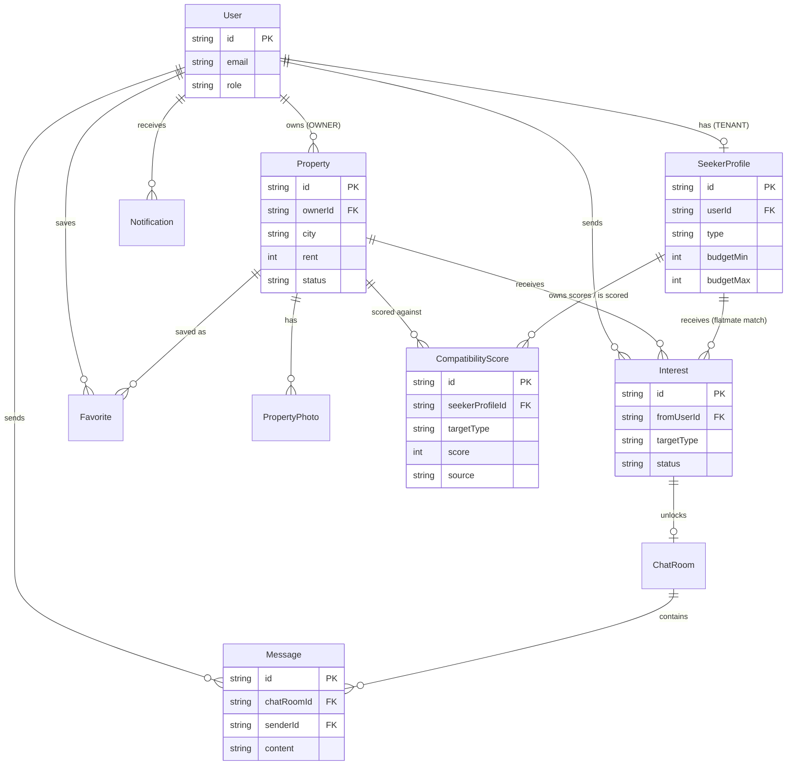

# Entity Relationship Diagram

## Two matching directions, one scoring table
- **Room search:** `SeekerProfile(type=ROOM_SEEKER)` → `Property` (owner's listing)
- **Flatmate search:** `SeekerProfile(type=FLATMATE_SEEKER)` → another `SeekerProfile` (public flatmate post)
- `CompatibilityScore.targetType` decides which foreign key (`targetPropertyId` or `targetSeekerProfileId`) is populated. Only one is ever non-null per row.
- Same rule applies to `Interest` — it can target a `Property` or a `SeekerProfile`, never both.
